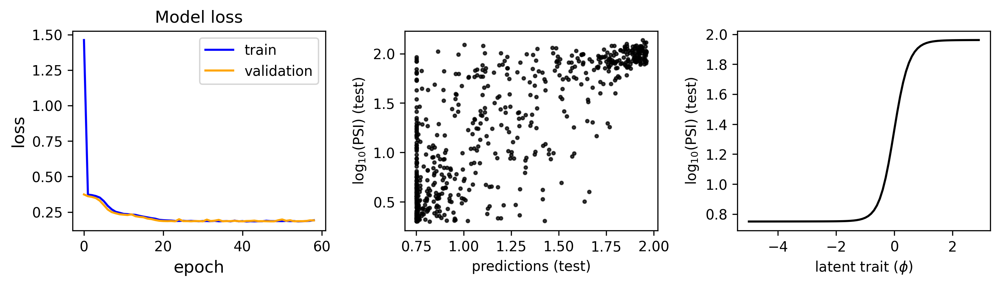
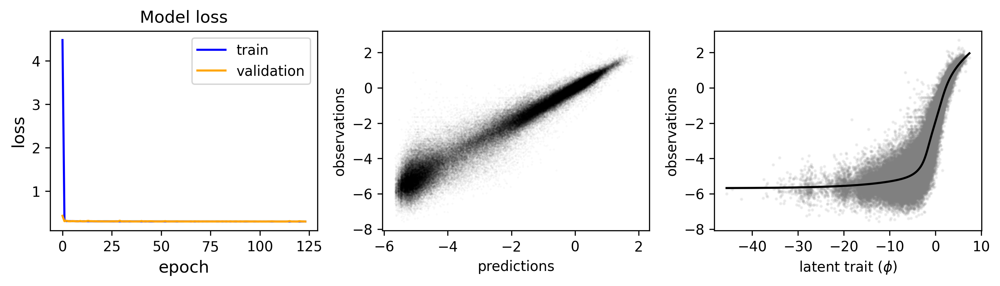
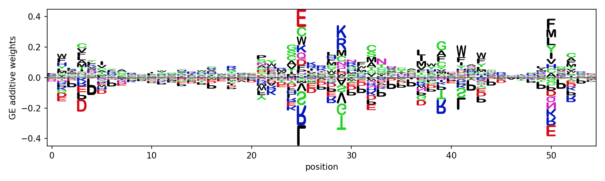
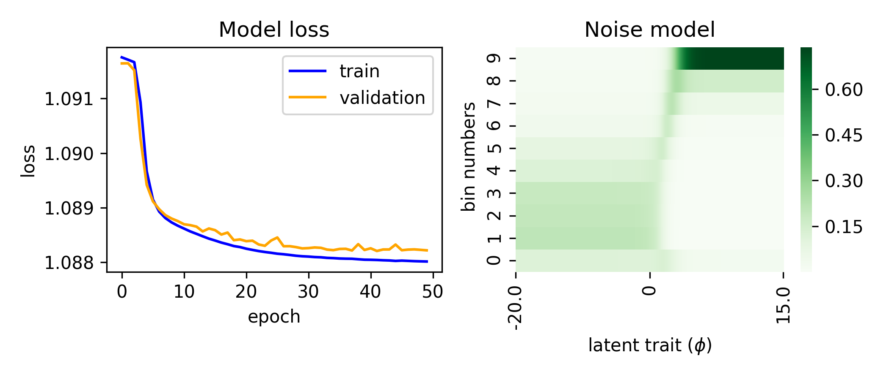
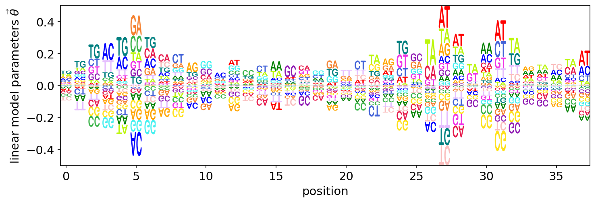

.. _examples:

Examples
========

As described in :ref:`quickstart`, global epistasis and noise agnostic models can 
be fit to data, as shown in Tareen and Kinney (2020) using the function ``mavenn.demo``. 
Here we describe each of these analyses, as well as the snippets of code used to 
generate them. All snippets shown below are designed for use within a Jupyter Notebook, 
and assume that the following header cell has already been run. ::

    # standard imports
    import numpy as np
    import pandas as pd
    import matplotlib.pyplot as plt
    from sklearn.model_selection import train_test_split

    # displays logos inline within the notebook;
    # remove if using a python interpreter instead
    %matplotlib inline

    # mavenn import
    import mavenn

Additive GE model: (MPSA)
-------------------------

Example snippet for fitting additive GE model to MPSA data ::

    # load data
    X, y = get_example_dataset(name='MPSA')

    # split data into training and testing sets
    x_train, x_test, y_train, y_test = train_test_split(X, y)

    # load mavenn's GE model
    GER = mavenn.Model(regression_type='GE',
                       X=x_train,
                       y=y_train,
                       model_type='additive',
                       learning_rate=0.005,
                       alphabet_dict='rna')

    GER.fit(epochs=200, use_early_stopping=True, early_stopping_patience=20, verbose=1)

    # make predictions on held out test set
    loss_history = GER.model.return_loss()
    predictions = GER.model.predict(x_test)

    # plot results using helper function
    ge_plots_for_mavenn_demo(loss_history, predictions, y_test, x_test, GER)

	

	

Pairwise GE model: (MPSA)
-------------------------

Example snippet for fitting pairwise GE model to MPSA data ::

    # load data
    X, y = get_example_dataset(name='MPSA')

    # split data into training and testing sets
    x_train, x_test, y_train, y_test = train_test_split(X, y)

    # load mavenn's GE model
    GER = mavenn.Model(regression_type='GE',
                       X=x_train,
                       y=y_train,
                       model_type='pairwise',
                       learning_rate=0.001,
                       alphabet_dict='rna')

    # fit model to data
    GER.fit(epochs=200, use_early_stopping=True, early_stopping_patience=20, verbose=1)

    # make predictions on held out test set
    loss_history = GER.model.return_loss()
    predictions = GER.model.predict(x_test)

    # plot results using helper function
    ge_plots_for_mavenn_demo(loss_history, predictions, y_test, x_test, GER)

.. image:: _static/examples_images/GE_pairwise_mpsa_demo.png

Additive GE model: (DMS)
------------------------

Example snippet for fitting pairwise GE model to DMS data (note: this example
may take over 10 minutes to complete) ::

    # load data
    X, y = get_example_dataset(name='GB1-DMS')

    # split data into training and testing sets
    x_train, x_test, y_train, y_test = train_test_split(X, y)

    # load mavenn's GE model
    GER = mavenn.Model(regression_type='GE',
                       X=x_train,
                       y=y_train,
                       model_type='additive',
                       learning_rate=0.001,
                       alphabet_dict='protein',
                       ohe_single_batch_size=100000)

    # fit model to data
    GER.fit(epochs=100, use_early_stopping=True, early_stopping_patience=20, verbose=1)

    # make predictions on held out test set
    loss_history = GER.model.return_loss()
    predictions = GER.model.predict(x_test)

    loss_history = GER.model.return_loss()
    predictions = GER.model.predict(x_test)

    ge_plots_for_mavenn_demo(loss_history, predictions, y_test, x_test, GER)

Additive NA model: (Sort-Seq)
-----------------------------

Example snippet for inferring NA model from Sort-Seq data ::

    # load data
    sequences, bin_counts = get_example_dataset(name='Sort-Seq')

    # load mavenn's NA model
    NAR = mavenn.Model(regression_type='NA',
                       X=sequences,
                       y=bin_counts,
                       model_type='additive',
                       alphabet_dict='dna',
                       ohe_single_batch_size=50000)

    NAR.fit(epochs=200, use_early_stopping=True, early_stopping_patience=20, verbose=1)

    loss_history =  NAR.model.return_loss()

    # evaluate the inferred noise model for a given input range
    phi_range = np.linspace(-20, 20,1000)
    noise_model = NAR.na_noisemodel(sequences,
                                    input_range=phi_range)

    # plot results using helper function
    na_plots_for_mavenn_demo(loss_history, NAR, noise_model, phi_range)

.. image:: _static/examples_images/NA_additive_sort_seq_demo.png

Neighbor NA model: (Sort-Seq)
-----------------------------

Example snippet for inferring NA model from Sort-Seq data with nearest
neighbor interactions included ::

    # load data
    sequences, bin_counts = get_example_dataset(name='Sort-Seq')

    # load mavenn's NA model
    NAR = mavenn.Model(regression_type='NA',
                       X=sequences,
                       y=bin_counts,
                       model_type='neighbor',
                       alphabet_dict='dna',
                       ohe_single_batch_size=50000)

    NAR.fit(epochs=200, use_early_stopping=True, early_stopping_patience=20, verbose=1)

    loss_history =  NAR.model.return_loss()

    # evaluate the inferred noise model for a given input range
    phi_range = np.linspace(-20, 15,1000)
    noise_model = NAR.na_noisemodel(sequences,
                                    input_range=phi_range)

    # results plot using custom logomaker script

