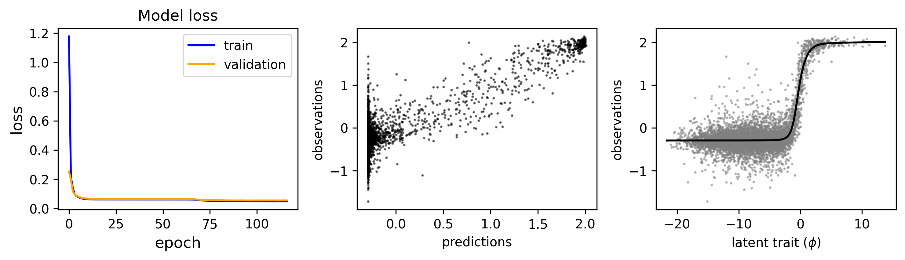
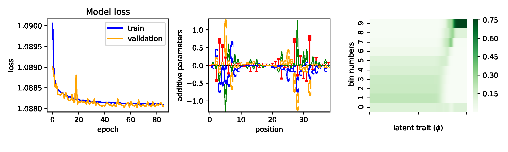

========================================================================================
MAVE-NN: Quantitative Modeling of Sequence-Function Relationships using Neural Networks
========================================================================================

MAVE-NN is a python package for inferring models of sequence-function relationships from 
multiplexed assays of variant effects (MAVEs). MAVE-NN currently implements global epistasis 
regression and noise agnostic regression. Both models are implemented as neural networks 
using TensorFlow. The :ref:`installation`, :ref:`quickstart`,  :ref:`examples`, 
and :ref:`tutorial` sections below are provided to help users  quickly get 
MAVE-NN working for their own research needs.

.. toctree::
   :maxdepth: 2
   :caption: Contents:

.. _installation:

Installation
--------------

MAVE-NN has minimal dependencies and is compatible with both Python 2.7 and Python 3.6.
The code for MAVENN is available on `GitHub <https://github.com/jbkinney/mavenn>`_ under an MIT open source license.
mavenn can be installed from `PyPI <https://pypi.org/project/mavenn/>`_ using the ``pip`` package manager by executing the following at the commandline: ::

    pip install mavenn

.. _quickstart:

Quick Start
-----------

For a quick demonstration of mavenn's global epistasis model, execute the following within Python::

   import mavenn
   mavenn.demo(name='GEmpsaPairwise')

This command will train a pairwise global epistasis model on massively parallel
splicing assay data from Wong et al. 2018 [#Wong2018]_ and return the loss history, predictions vs.
true labels, and the global epistasis nonlinear function.

For a demonstration of mavenn's noise agnostic model, execute the following within Python::

   import mavenn
   mavenn.demo(name='NAsortseq')

This command will train an additive noise agnostic model on Sort-Seq
data from Kinney et. al. (2010) [#sortseq2010]_ and return the loss history, inferred additive
parameters as a sequence logo, and the inferred noise model.

.. _tutorial:

Tutorial
--------

A tutorial is available via a series of Jupyter notebooks, each of which focuses on a different aspect of mavenn's
functionality. To view the notebooks statically on GitHub,
`click here <https://github.com/jbkinney/mavenn/tree/master/mavenn/tutorials>`_.

Resources
---------

.. toctree::
    :maxdepth: 2

    examples
    implementation

Reference
----------

Manuscript link.

.. [#Wong2018] Wong MS, Kinney JB, Krainer AR. Quantitative Activity Profile and Context Dependence of All Human 5'
    Splice Sites. Mol Cell. 2018;71(6):1012-1026.e3. `<https://doi.org/10.1016/j.molcel.2018.07.033>`_

.. [#sortseq2010] Kinney JB, Murugan A, Callan CG, Cox EC (2010). Using deep sequencing to characterize the
    biophysical mechanism of a transcriptional regulatory sequence. Proc Natl Acad Sci USA 107:9158-9163.
    `PubMed. <https://www.ncbi.nlm.nih.gov/pubmed/20439748>`_

Contact
-------

For technical assistance or to report bugs, please contact Ammar Tareen (`Email: tareen@cshl.edu <tareen@cshl.edu>`_, `Twitter: @AmmarTareen1 <https://twitter.com/AmmarTareen1>`_) . For more general correspondence, please contact Justin Kinney (`Email: jkinney@cshl.edu <jkinney@cshl.edu>`_, `Twitter: @jbkinney <https://twitter.com/jbkinney>`_).

Links
-----

- `Kinney Lab <http://kinneylab.labsites.cshl.edu/>`_
- `Cold Spring Harbor Laboratory <https://www.cshl.edu/>`_
