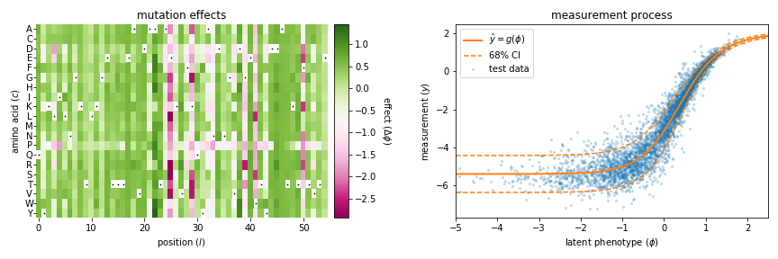

=================================================================================
MAVE-NN: learning genotype-phenotype maps from multiplex assays of variant effect
=================================================================================

MAVE-NN enables the rapid quantitative modeling of genotype-phenotype (G-P) maps from the data produced by multiplex assays of variant effect (MAVEs). Such assays include deep mutational scanning (DMS) experiments on proteins, massively parallel reporter assays (MPRAs) on DNA or RNA regulatory sequences, and more. MAVE-NN conceptualizes G-P map inference as a problem in information compression; this problem is then solved by training a neural network using a TensorFlow backend. 

A key feature of MAVE-NN is that it explicitly accounts for the indirect nature of MAVE measurements. Specifically, MAVE-NN models these measurements as arising from noisy nonlinear readouts of an underlying **latent phenotype**, the values of which reflect the G-P map of interest. For example, the figure below illustrates a model inferred by MAVE-NN from a well-known DMS experiment on protein GB1 [#Olson2014]_. The left panel shows the inferred G-P map, which assumes that each amino acid within a 55 residue protein contributes independently to the  relevant latent phenotype. The right panel shows the nonlinear stochastic relationship that then maps these latent phenotype values to actual DMS measurements.

MAVE-NN is written for Python 3 and is provided under an MIT open source license. The documentation provided here is meant help users quickly get MAVE-NN working for their own research needs. Please do not hesitate to contact us with any questions or suggestions for improvements.

Documentation
-------------

.. toctree::
    :maxdepth: 2

    installation
    demos
    tutorials
    datasets
    methods
    implementation

References
----------

.. [#Olson2014] Olson C, Wu N, Sun R. (2014). A comprehensive biophysical
    description of pairwise epistasis throughout an entire protein domain.
    Curr Biol. 24(22):2643-2651.
    `<https://pubmed.ncbi.nlm.nih.gov/25455030/>`_

.. [#Tareen2020] Tareen A, Posfai A, Ireland WT,  McCandlish DM, Kinney JB.
    MAVE-NN: learning genotype-phenotype maps from multiplex assays of variant effect
    Biorxiv (2020). `<https://doi.org/10.1101/2020.07.14.201475>`_

Contact
-------

For technical assistance or to report bugs, please contact Ammar Tareen (`Email: tareen@cshl.edu <tareen@cshl.edu>`_, `Twitter: @AmmarTareen1 <https://twitter.com/AmmarTareen1>`_) . For more general correspondence, please contact Justin Kinney (`Email: jkinney@cshl.edu <jkinney@cshl.edu>`_, `Twitter: @jbkinney <https://twitter.com/jbkinney>`_).

Links
-----

- `Kinney Lab <http://kinneylab.labsites.cshl.edu/>`_
- `Cold Spring Harbor Laboratory <https://www.cshl.edu/>`_

