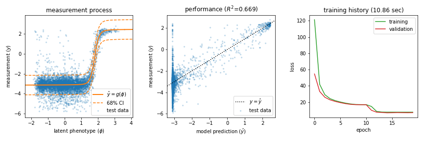

========================================================================
MAVE-NN: genotype-phenotype maps from multiplex assays of variant effect
========================================================================

MAVE-NN enables the rapid quantitative modeling of genotype-phenotype (G-P) maps from the data produced by multiplex assays of variant effect (MAVEs). Such assays include deep mutational scanning (DMS) experiments on proteins, massively parallel reporter assays (MPRAs) on DNA or RNA regulatory sequences, and more. MAVE-NN conceptualizes G-P map inference as a problem in information compression; this problem is then solved by training a neural network using a TensorFlow backend. 

MAVE-NN is written for Python 3 and is provided under an
MIT open source license. The :ref:`installation`, :ref:`quickstart`,
and :ref:`tutorial` sections below will help users quickly get
MAVE-NN working for their own research needs.

.. _installation:

Installation
--------------

MAVE-NN can be installed from `PyPI <https://pypi.org/project/mavenn/>`_
using the ``pip`` package manager by executing the following at the
commandline: ::

    pip install mavenn

Alternatively, you can clone MAVE-NN from
`GitHub <https://github.com/jbkinney/mavenn>`_ by doing
this at the command line: ::

    $ cd appropriate_directory
    $ git clone https://github.com/jbkinney/mavenn.git

where ``appropriate_directory`` is the absolute path to where you would like
MAVE-NN to reside. Then add this to the top of any Python file in
which you use MAVE-NN: ::

    # Insert local path to MAVE-NN at beginning of Python's path
    import sys
    sys.path.insert(0, "appropriate_directory/mavenn")

    #Load mavenn
    import mavenn

.. _quickstart:

Quick Start
-----------

For a quick demonstration of MAVE-NN's capabilities, execute the following
within Python::

   import mavenn
   mavenn.list_demos()

This will produce a list of names for multiple built-in demos. Then choose
whichever demo you like. For example, try running the "mpsa_ge_training" demo::

    mavenn.run_demo(name="mpsa_ge_training", print_code=False)

This trains a model on massively parallel splicing assay (MPSA) performed by
Wong et al. 2018 [#Wong2018]_, a process that takes approximately 15 seconds.
It also produces the following figure, which illustrates model performance
and training history. If you set ``print_code=True``, the code used to perform
these computations will also be printed.

.. _tutorial:

Tutorial
--------

Jupyter notebook tutorials covering a variety of MAVE-NN's capabilities
are available on GitHub at
`here <https://github.com/jbkinney/mavenn/tree/master/mavenn/examples/tutorials>`_.
If you have installed MAVE-NN, you can locate these notebooks on your local
machine by running the following in Python: ::

    import mavenn
    mavenn.list_tutorials()

Resources
---------

.. toctree::
    :maxdepth: 2

    implementation

Reference
----------

.. [#Tareen2020] Tareen A, Ireland WT, Posfai A, McCandlish DM, Kinney JB.
    MAVE-NN: Quantitative Modeling of Genotype-Phenotype Maps as Information Bottlenecks 
    Biorxiv (2020). `<https://doi.org/10.1101/2020.07.14.201475>`_

.. [#Wong2018] Wong MS, Kinney JB, Krainer AR. Quantitative Activity Profile and Context Dependence of All Human 5'
    Splice Sites. Mol Cell. 2018;71(6):1012-1026.e3. `<https://doi.org/10.1016/j.molcel.2018.07.033>`_

Contact
-------

For technical assistance or to report bugs, please contact Ammar Tareen (`Email: tareen@cshl.edu <tareen@cshl.edu>`_, `Twitter: @AmmarTareen1 <https://twitter.com/AmmarTareen1>`_) . For more general correspondence, please contact Justin Kinney (`Email: jkinney@cshl.edu <jkinney@cshl.edu>`_, `Twitter: @jbkinney <https://twitter.com/jbkinney>`_).

Links
-----

- `Kinney Lab <http://kinneylab.labsites.cshl.edu/>`_
- `Cold Spring Harbor Laboratory <https://www.cshl.edu/>`_

